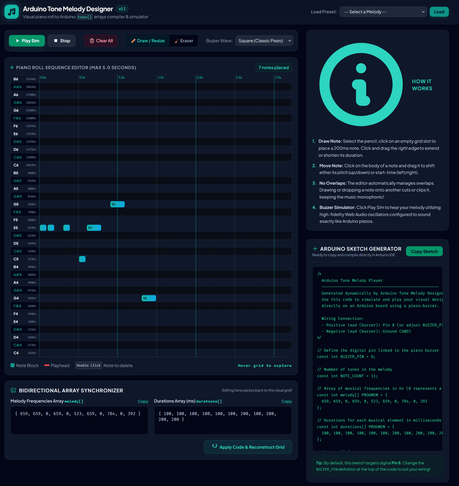

# arduino-tone-composer
Helper webapp for arduino music generation/simulation.

Hosted at: https://tgjohnst.github.io/arduino-tone-composer/



# **🎵 Arduino Tone Melody Designer & Simulator**

An interactive, web-based visual sequencer designed to help developers and hobbyists compose, simulate, and compile melodies for the Arduino tone() function.  
This single-file utility provides a robust **piano roll canvas**, an **automatic monophonic solver** (preventing overlaps), real-time **Web Audio API buzzer simulation**, and **bidirectional code synchronizing** to turn C++ arrays back into visual grids instantly.

## **🚀 Live Features**

* **Interactive Chromatic Piano Roll**: Compose across 3 octaves (C4 to B6) with a grid that locks note events into tight 100ms increments up to a max duration of 5 seconds (50 columns).  
* **Monophonic Overlap Resolver**: The Arduino buzzer is strictly single-voice (monophonic). The editor enforces this rule in real-time. If you draw, move, or stretch a note block over another, the app automatically cuts, crops, or splits the surrounding notes to keep the melody monophonic.  
* **Synthesizer Simulator**: Hear your creations immediately. Choose between classic piezo buzzers (Square), chiptune tones (Triangle), pure synth waves (Sine), or aggressive retro brass (Sawtooth). Includes a moving playback red head.  
* **Bidirectional Array Synchronizer**:  
  * Visual note placements instantly compile into C++ melody\[\] and durations\[\] arrays.  
  * Modify or paste raw C++ arrays directly into the text fields, click **"Apply Code"**, and watch the visual sequencer instantly reconstruct.  
* **Complete Arduino C++ Sketch Generator**: Exports complete compile-ready C++ code using PROGMEM to prevent variables from hogging your microchip's limited dynamic SRAM.  
* **Built-in Soundtrack Presets**: Instant load triggers for *Super Mario Main Theme Intro*, *Star Wars Imperial March Theme*, *Zelda Secret Sound*, or a *Major Pentatonic Scale Run*.

## **🛠️ Quick Start**

Because this tool is built entirely within a single, self-contained HTML file (index.html), it requires no build steps, Node packages, or server installation.

### **Local Execution**

1. Download or clone this repository.  
2. Locate index.html.  
3. Double-click to open it instantly in any modern web browser.

### **Hosting (Zero Config)**

To share your composer with others, simply deploy it using **GitHub Pages**:

1. Go to your repository **Settings** on GitHub.  
2. Under the **Code and automation** section on the left sidebar, click **Pages**.  
3. Under **Build and deployment**, set the source to Deploy from a branch.  
4. Choose your branch (typically main) and root folder (/), then click **Save**.  
5. Your app will be live globally in less than a minute\!

## **🕹️ How to Use**

### **1\. Pencil Mode (Draw / Resize / Move)**

* **To Paint**: Select ✏️ Draw / Resize in the toolbar. Click anywhere on the dark grid to drop a default 200ms note.  
* **To Stretch**: Hover over the right edge of any note block until the cursor changes to ew-resize. Click and drag left/right to adjust duration in increments of 100ms.  
* **To Move**: Click on the center body of any note block and drag it around to shift its pitch up/down, or slide it forwards/backwards in time.

### **2\. Eraser Mode (Delete Notes)**

* Select 🧹 Eraser in the toolbar, then click on note blocks to delete them.  
* Alternatively, stay in Pencil mode and **double-click** any note block to remove it quickly.

### **3\. Bidirectional Sync**

Got a custom array in an old Arduino file you want to inspect?

* Paste your frequencies inside the melody\[\] field: { 523, 0, 523, 659, 784 }  
* Paste your millisecond timings inside the durations\[\] field: { 100, 100, 100, 200, 400 }  
* Click **Apply Code & Reconstruct Grid** to populate the visual grid and listen to it.

## **🔌 Hardware Setup & Connection**

To play your exported code on physical hardware, wire up a passive piezo-buzzer or small speaker to your Arduino board

⚠️ **Note:** Standard piezo elements can pull current spikes. To protect your Arduino's microcontroller output pin, it is highly recommended to place a 100ohm-220ohm resistor in series with the positive lead.

## **⚙️ Memory Optimization (PROGMEM)**

When defining extensive musical arrays on Arduino, placing large arrays in RAM will quickly trigger memory warning faults on boards like the Arduino Uno (which only has 2kb of dynamic SRAM).  
This app resolves this by compiling your melody and durations as PROGMEM data types:  
```
const int melody\[\] PROGMEM \= { ... };  
const int durations\[\] PROGMEM \= { ... };
```
This forces the compiler to store the notes inside **Flash memory** (where your compiled program resides), leaving your active dynamic RAM entirely free for other variables and program state. During playback, the code reads notes directly from flash using:  
```
int notePitch \= pgm\_read\_word\_near(melody \+ thisNote);  
int noteDuration \= pgm\_read\_word\_near(durations \+ thisNote);
```
## **📜 License**

This project is licensed under the MIT License \- feel free to use, modify, and build upon it for commercial or non-commercial projects\!

AI disclosure - this app was a one-shot(ish) generation with Gemini 3.5 Flash + Canvas.
